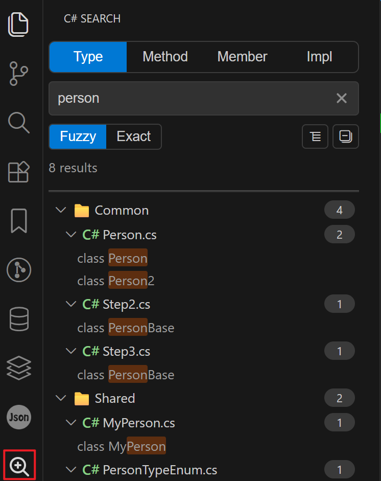
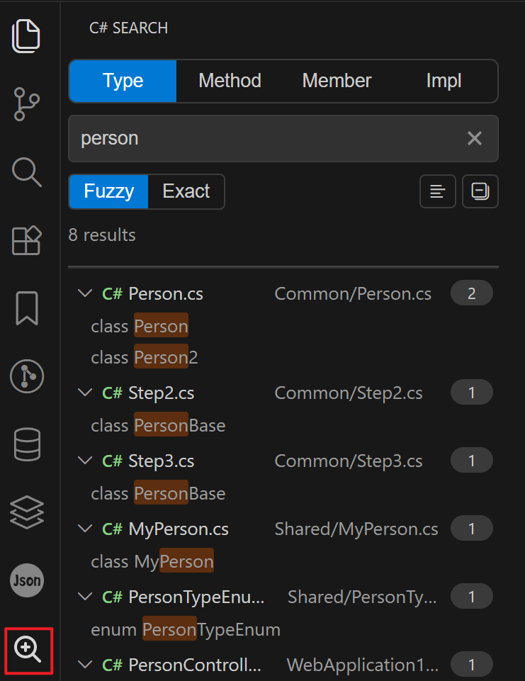

# C# Search

[English](#english) | [中文](#中文)

## English

A focused VS Code extension for searching `Type`, `Method`, `Member`, and `Impl` C# symbols from a dedicated Activity Bar view.

### Preview

### Features

- Dedicated Activity Bar entry: `C# Search`.
- Tab-based symbol search:
  - `Type`: class / interface / struct / enum / record.
  - `Method`: methods and constructors.
  - `Member`: fields and properties.
  - `Impl`: implementations by interface/base type.
- Switchable result view: `Tree` / `List` (single toolbar toggle button).
- Single-click `Expand/Collapse All` in result view toolbar.
- Click a result to open file and jump to line.
- Focus search view shortcut: `Ctrl+T` (`Cmd+T` on macOS), same as Visual Studio.
- Incremental in-memory index with file watcher updates.

### Search Behavior

- The extension activates when the `C# Search` panel is opened for the first time.
- Triggering the focus command (`Ctrl+T` / `Cmd+T`) also opens the panel and activates the extension if it is not active yet.
- After activation, it builds an in-memory index for workspace `*.cs` files.
- During initial indexing, the search view shows indexing status/progress.
- Excludes `bin`, `obj`, `.git`, `.github`, `.vscode` by default.
- Updates cache incrementally on create/change/delete events.
- Supports `Fuzzy` / `Exact` mode switching, with case-insensitive matching, and returns up to the configured `csharpSearch.maxResults` (default `500`).
- Search results are loaded by pages while scrolling; each page size is controlled by `csharpSearch.pageSize` (default `100`).
- In `Impl`, search supports implementation type names and interface/base type names.
- Input placeholder text updates by active tab to indicate expected query intent.

### Understanding Search Results

- Two display modes are available in the toolbar:
  - `Tree`: folder → file (`.cs`) → matched line content.
  - `List`: file (`.cs`) groups → matched line content.
- In both modes:
  - Last-level entries show matched **full line preview** with query highlight.
  - File/group rows show result count badges.
  - Expand/collapse states are supported and can be toggled globally via toolbar.
- Clicking any last-level match opens the source file and jumps to the exact line.
- Result meta shows loaded count and total count while more pages are available.
- A single query returns up to `csharpSearch.maxResults` items (default `500`); if more matches exist, only the first N are kept.

### Configuration

#### `csharpSearch.excludeFolders`

- Type: `string[]`
- Default: `['bin', 'obj', '.git', '.github', '.vscode']`
- Description: Folder names excluded from indexing (matches at any path depth).

#### `csharpSearch.searchDebounceMs`

- Type: `number`
- Default: `300`
- Range: `0-1000`
- Description: Debounce delay (ms) before sending search request while typing.

#### `csharpSearch.pageSize`

- Type: `number`
- Default: `100`
- Range: `20-500`
- Description: Number of results loaded per page while scrolling.

#### `csharpSearch.maxResults`

- Type: `number`
- Default: `500`
- Range: `50-1000`
- Description: Maximum number of results returned per query.

### Development

- Install dependencies: `npm install`
- Build: `npm run compile`
- Watch mode: `npm run watch`
- Debug extension: press `F5`

### Repository

- GitHub: https://github.com/wjire/csharp-Search
- Gitee: https://gitee.com/dankit/csharp-search

## 中文

一个专注于 C# 符号检索的 VS Code 扩展，支持 `类型`、`方法`、`成员`、`实现` 四类检索，并提供独立的活动栏搜索视图。

### 预览

### 功能特性

- 活动栏独立入口：`C# Search`。
- 按类别检索符号：
  - `类型`：class / interface / struct / enum / record。
  - `方法`：方法与构造函数。
  - `成员`：字段与属性。
  - `实现`：按接口/基类检索实现或派生类型。
- 支持结果视图切换：`树形 / 列表`（顶部单按钮切换）。
- 支持结果区一键“全部展开 / 全部折叠”。
- 点击结果可打开文件并定位到行。
- 聚焦搜索视图快捷键：`Ctrl+T`（macOS 为 `Cmd+T`），与 Visual Studio 一致。
- 内存增量索引 + 文件监听更新。

### 搜索逻辑

- 首次打开 `C# Search` 面板时激活扩展。
- 触发聚焦命令（`Ctrl+T` / `Cmd+T`）也会打开该面板；若扩展尚未激活，将在此时激活。
- 激活后开始构建工作区 `*.cs` 文件内存索引。
- 首次索引期间，搜索视图会展示索引状态/进度。
- 默认排除 `bin`、`obj`、`.git`、`.github`、`.vscode`。
- 文件新增/修改/删除后增量刷新缓存。
- 支持“模糊匹配 / 精确匹配”切换，匹配大小写不敏感，单次最多返回 `csharpSearch.maxResults` 配置的条数（默认 `500`）。
- 搜索结果支持滚动分页加载，每页条数由 `csharpSearch.pageSize` 控制（默认 `100`）。
- 在“实现”标签下，可按实现类名、接口名或基类名检索。
- 输入框提示会根据当前标签动态切换，降低误搜成本。

### 搜索结果说明

- 顶部工具栏支持两种结果视图：
  - `树形`：目录 → 文件（`.cs`）→ 命中行内容。
  - `列表`：文件（`.cs`）分组 → 命中行内容。
- 两种视图下：
  - 最后一层均显示命中的**整行代码预览**，并保留关键字高亮。
  - 文件/分组层显示命中数量徽标。
  - 支持节点展开/折叠，并可通过工具栏进行全局展开/折叠。
- 点击任意最后一层命中项，会打开源文件并跳转到对应行。
- 结果区在存在更多分页时会显示“已加载/总数”。
- 单次查询最多返回 `csharpSearch.maxResults` 配置的条数（默认 `500`）；若实际命中更多，仅保留前 N 条。

### 配置项

#### `csharpSearch.excludeFolders`

- 类型：`string[]`
- 默认：`['bin', 'obj', '.git', '.github', '.vscode']`
- 说明：按目录名排除索引，匹配工作区路径任意层级。

#### `csharpSearch.searchDebounceMs`

- 类型：`number`
- 默认：`300`
- 范围：`0-1000`
- 说明：输入时发送搜索请求前的防抖延迟（毫秒）。

#### `csharpSearch.pageSize`

- 类型：`number`
- 默认：`100`
- 范围：`20-500`
- 说明：结果列表滚动加载时每页返回条数。

#### `csharpSearch.maxResults`

- 类型：`number`
- 默认：`500`
- 范围：`50-1000`
- 说明：单次查询返回结果上限。

### 开发

- 安装依赖：`npm install`
- 编译：`npm run compile`
- 监听编译：`npm run watch`
- 启动调试：按 `F5`

### 仓库地址

- GitHub: https://github.com/wjire/csharp-Search
- Gitee: https://gitee.com/dankit/csharp-search

## License

MIT