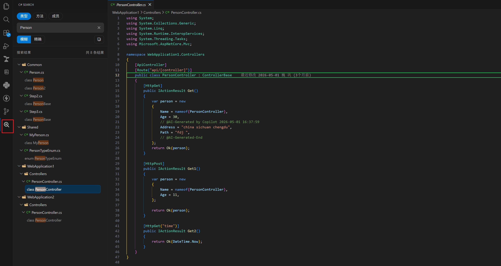

# C# Search

[English](#english) | [中文](#中文)

## English

A focused VS Code extension for searching `Type`, `Method`, and `Member` C# symbols from a dedicated Activity Bar view.

### Preview

### Features

- Dedicated Activity Bar entry: `C# Search`.
- Tab-based symbol search:
  - `Type`: class / interface / struct / enum / record.
  - `Method`: methods and constructors.
  - `Member`: fields and properties.
- Compact hierarchical result tree: folder -> file -> matched line.
- Single-click `Expand/Collapse All` in result view toolbar.
- Click a result for preview in editor; double-click to open and keep location.
- Focus search view shortcut: `Ctrl+T` (`Cmd+T` on macOS), same as Visual Studio.
- Incremental in-memory index with file watcher updates.

### Index Persistence (New)

- Index snapshots are now persisted per workspace in extension storage.
- First open of a workspace builds the index and writes snapshot to disk; next opens reuse it for faster startup.
- Cache validity is checked by extension version, workspace key, and indexing-related settings.
- After index changes, snapshot persistence runs in debounced background writes (atomic temp-file replace).

### Search Behavior

- The extension activates when the `C# Search` panel is opened for the first time.
- Triggering the focus command (`Ctrl+T` / `Cmd+T`) also opens the panel and activates the extension if it is not active yet.
- Indexing starts only when the opened workspace is detected as a .NET project.
- In non-.NET workspaces, the view shows an unsupported-workspace hint and does not start indexing.
- During initial indexing, the search view shows indexing status/progress.
- During first-time indexing in a workspace, the search view shows a friendly first-index hint and progress.
- Queries can return partial results before the initial index is fully built, and the result set refreshes automatically while indexing continues.
- Excludes `bin`, `obj`, `.git`, `.github`, `.vscode` by default.
- Updates cache incrementally on create/change/delete events.
- Initial indexing excludes configured folders during file discovery and uses adaptive parallel workers to improve large-workspace startup time.
- Index snapshots are persisted per workspace in extension storage and reused on next open (validated by extension version, workspace key, and indexing-related settings), then kept in sync via debounced background writes.
- Supports `Fuzzy` / `Exact` mode switching, with case-insensitive matching, and returns up to the configured `csharpSearch.maxResults` (default `500`).
- Search results are loaded by pages while scrolling; each page size is controlled by `csharpSearch.pageSize` (default `100`).
- Input placeholder text updates by active tab to indicate expected query intent.

### Understanding Search Results

- Result tree layout: folder -> file (`.cs`) -> matched line content.
- Last-level entries show matched **full line preview** with query highlight.
- File rows show result count badges and support expand/collapse (including global toolbar toggle).
- Single-click previews result location in editor (to side), double-click opens and keeps focus/location.
- Result meta shows loaded count and total count while more pages are available.
- A single query returns up to `csharpSearch.maxResults` items (default `500`); if more matches exist, only the first N are kept.

### Configuration

#### `csharpSearch.excludeFolders`

- Type: `string[]`
- Default: `['bin', 'obj', '.git', '.github', '.vscode']`
- Description: Folder names excluded from indexing (matches at any path depth).

#### `csharpSearch.searchDebounceMs`

- Type: `number`
- Default: `300`
- Range: `0-1000`
- Description: Debounce delay (ms) before sending search request while typing.

#### `csharpSearch.updateDebounceMs`

- Type: `number`
- Default: `900`
- Range: `0-5000`
- Description: Debounce delay (ms) before applying batched file-change updates to in-memory index.

#### `csharpSearch.persistDebounceMs`

- Type: `number`
- Default: `1200`
- Range: `0-10000`
- Description: Debounce delay (ms) before persisting updated index snapshot to disk.

#### `csharpSearch.pageSize`

- Type: `number`
- Default: `100`
- Range: `20-500`
- Description: Number of results loaded per page while scrolling.

#### `csharpSearch.maxResults`

- Type: `number`
- Default: `500`
- Range: `50-1000`
- Description: Maximum number of results returned per query.

### Development

- Install dependencies: `npm install`
- Build: `npm run compile`
- Watch mode: `npm run watch`
- Debug extension: press `F5`

### Repository

- GitHub: https://github.com/wjire/csharp-Search
- Gitee: https://gitee.com/dankit/csharp-search

## 中文

一个专注于 C# 符号检索的 VS Code 扩展，支持 `类型`、`方法`、`成员` 三类检索，并提供独立的活动栏搜索视图。

### 预览

### 功能特性

- 活动栏独立入口：`C# Search`。
- 按类别检索符号：
  - `类型`：class / interface / struct / enum / record。
  - `方法`：方法与构造函数。
  - `成员`：字段与属性。
- 紧凑层级结果树：目录 -> 文件 -> 命中行。
- 支持结果区一键“全部展开 / 全部折叠”。
- 单击结果在编辑器中预览定位，双击结果固定打开。
- 聚焦搜索视图快捷键：`Ctrl+T`（macOS 为 `Cmd+T`），与 Visual Studio 一致。
- 内存增量索引 + 文件监听更新。

### 索引持久化（新增）

- 新增按工作区隔离的索引快照持久化能力（落盘到扩展存储）。
- 工作区首次打开会构建索引并写入快照，后续再次打开优先复用快照，启动更快。
- 缓存有效性会校验扩展版本、工作区标识、索引相关配置。
- 索引变更后通过防抖后台写入并采用原子替换，降低写盘频率并保证文件完整性。

### 搜索逻辑

- 首次打开 `C# Search` 面板时激活扩展。
- 触发聚焦命令（`Ctrl+T` / `Cmd+T`）也会打开该面板；若扩展尚未激活，将在此时激活。
- 仅当判定当前工作区为 .NET 项目时，才会启动索引构建。
- 非 .NET 工作区会显示“当前工作区不是 .NET 项目，未启动索引”，且不会触发索引构建。
- 首次索引期间，搜索视图会展示更友好的“首次创建索引”提示与进度。
- 首次索引尚未完成时，查询也可以先返回已建立部分的结果，且随着索引推进会自动刷新。
- 默认排除 `bin`、`obj`、`.git`、`.github`、`.vscode`。
- 文件新增/修改/删除后增量刷新缓存。
- 首次索引会在文件发现阶段就排除配置目录，并采用自适应并发处理文件，降低大型工作区的首开等待。
- 索引快照会按工作区落盘到扩展存储并在下次打开时复用（校验扩展版本、工作区标识和索引相关配置），随后通过防抖后台写入持续同步。
- 支持“模糊匹配 / 精确匹配”切换，匹配大小写不敏感，单次最多返回 `csharpSearch.maxResults` 配置的条数（默认 `500`）。
- 搜索结果支持滚动分页加载，每页条数由 `csharpSearch.pageSize` 控制（默认 `100`）。
- 输入框提示会根据当前标签动态切换，降低误搜成本。

### 搜索结果说明

- 结果区域采用树形层级：目录 -> 文件（`.cs`）-> 命中行内容。
- 最后一层显示命中的**整行代码预览**，并保留关键字高亮。
- 文件层显示命中数量徽标，支持节点展开/折叠，并可通过工具栏进行全局展开/折叠。
- 单击命中项会在编辑器中预览定位（右侧），双击会固定打开并保留焦点/定位。
- 结果区在存在更多分页时会显示“已加载/总数”。
- 单次查询最多返回 `csharpSearch.maxResults` 配置的条数（默认 `500`）；若实际命中更多，仅保留前 N 条。

### 配置项

#### `csharpSearch.excludeFolders`

- 类型：`string[]`
- 默认：`['bin', 'obj', '.git', '.github', '.vscode']`
- 说明：按目录名排除索引，匹配工作区路径任意层级。

#### `csharpSearch.searchDebounceMs`

- 类型：`number`
- 默认：`300`
- 范围：`0-1000`
- 说明：输入时发送搜索请求前的防抖延迟（毫秒）。

#### `csharpSearch.updateDebounceMs`

- 类型：`number`
- 默认：`900`
- 范围：`0-5000`
- 说明：将文件变更批量应用到内存索引前的防抖延迟（毫秒）。

#### `csharpSearch.persistDebounceMs`

- 类型：`number`
- 默认：`1200`
- 范围：`0-10000`
- 说明：索引变化后写入磁盘快照前的防抖延迟（毫秒）。

#### `csharpSearch.pageSize`

- 类型：`number`
- 默认：`100`
- 范围：`20-500`
- 说明：结果列表滚动加载时每页返回条数。

#### `csharpSearch.maxResults`

- 类型：`number`
- 默认：`500`
- 范围：`50-1000`
- 说明：单次查询返回结果上限。

### 开发

- 安装依赖：`npm install`
- 编译：`npm run compile`
- 监听编译：`npm run watch`
- 启动调试：按 `F5`

### 仓库地址

- GitHub: https://github.com/wjire/csharp-Search
- Gitee: https://gitee.com/dankit/csharp-search

## License

MIT
