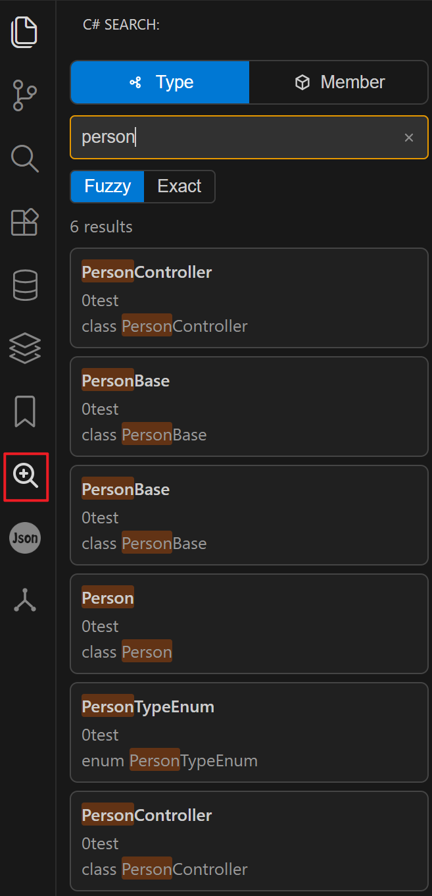
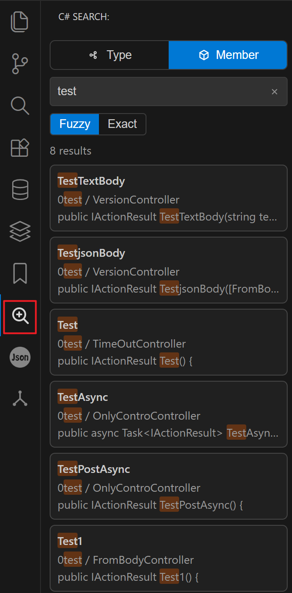

# C# Search

[English](#english) | [中文](#中文)

## English

A focused VS Code extension for searching C# symbols from a dedicated Activity Bar view.

### Preview

### Features

- Dedicated Activity Bar entry: `C# Search`.
- Tab-based symbol search:
  - `Type`: class / interface / struct / enum / record.
  - `Member`: methods and member declarations.
- Real-time search while typing.
- Switchable match modes: `Fuzzy` / `Exact`.
- Click a result to open file and jump to line.
- Focus search view shortcut: `Ctrl+T` (`Cmd+T` on macOS), same as Visual Studio.
- Incremental in-memory index with file watcher updates.
- Bilingual webview UI (Chinese/English) following VS Code language.

### Search Behavior

- Builds an in-memory index for workspace `*.cs` files on startup.
- Excludes `bin`, `obj`, `.git`, `.github`, `.vscode` by default.
- Updates cache incrementally on create/change/delete events.
- Supports `Fuzzy` / `Exact` mode switching, with case-insensitive matching, and returns up to 500 results.

### Configuration

#### `csharpSearch.excludeFolders`

- Type: `string[]`
- Default: `['bin', 'obj', '.git', '.github', '.vscode']`
- Description: Folder names excluded from indexing (matches at any path depth).

#### `csharpSearch.searchDebounceMs`

- Type: `number`
- Default: `300`
- Range: `0-1000`
- Description: Debounce delay (ms) before sending search request while typing.

### Localization

- Webview texts are provided by the extension host and switch automatically via `vscode.env.language`.
- Manifest strings are localized through VS Code `package.nls` files:
  - `package.nls.json` (default/en)
  - `package.nls.zh-cn.json` (zh-cn)

### Project Structure

- `src/search/ISymbolSearcher.ts`: search strategy interface.
- `src/search/SymbolSearchService.ts`: search orchestration.
- `src/search/SymbolIndexCache.ts`: symbol index + file watching.
- `src/search/searchers/TypeSearcher.ts`: type search strategy.
- `src/search/searchers/MethodSearcher.ts`: member search strategy.
- `src/webview/CSharpSearchViewProvider.ts`: webview message bridge.
- `media/search-view.*`: webview UI.

### Development

- Install dependencies: `npm install`
- Build: `npm run compile`
- Watch mode: `npm run watch`
- Debug extension: press `F5`

### Repository

- GitHub: https://github.com/wjire/csharp-Search
- Gitee: https://gitee.com/dankit/csharp-search

## 中文

一个专注于 C# 符号检索的 VS Code 扩展，提供独立的活动栏搜索视图。

### 预览

### 功能特性

- 活动栏独立入口：`C# Search`。
- 按类别检索符号：
  - `类型`：class / interface / struct / enum / record。
  - `成员`：方法与成员声明。
- 输入即搜，实时返回结果。
- 支持“模糊匹配 / 精确匹配”切换。
- 点击结果可打开文件并定位到行。
- 聚焦搜索视图快捷键：`Ctrl+T`（macOS 为 `Cmd+T`），与 Visual Studio 一致。
- 内存增量索引 + 文件监听更新。
- Webview 界面支持中英双语并跟随 VS Code 语言。

### 搜索逻辑

- 启动时构建工作区 `*.cs` 文件内存索引。
- 默认排除 `bin`、`obj`、`.git`、`.github`、`.vscode`。
- 文件新增/修改/删除后增量刷新缓存。
- 支持“模糊匹配 / 精确匹配”切换，匹配大小写不敏感，最多返回 500 条。

### 配置项

#### `csharpSearch.excludeFolders`

- 类型：`string[]`
- 默认：`['bin', 'obj', '.git', '.github', '.vscode']`
- 说明：按目录名排除索引，匹配工作区路径任意层级。

#### `csharpSearch.searchDebounceMs`

- 类型：`number`
- 默认：`300`
- 范围：`0-1000`
- 说明：输入时发送搜索请求前的防抖延迟（毫秒）。

### 本地化

- Webview 文案由扩展端下发，基于 `vscode.env.language` 自动切换。
- 扩展清单文案使用 VS Code 的 `package.nls` 机制：
  - `package.nls.json`（默认/英文）
  - `package.nls.zh-cn.json`（中文）

### 目录结构

- `src/search/ISymbolSearcher.ts`：搜索策略接口。
- `src/search/SymbolSearchService.ts`：搜索编排。
- `src/search/SymbolIndexCache.ts`：符号索引与文件监听。
- `src/search/searchers/TypeSearcher.ts`：类型检索。
- `src/search/searchers/MethodSearcher.ts`：成员检索。
- `src/webview/CSharpSearchViewProvider.ts`：Webview 消息桥接。
- `media/search-view.*`：Webview 前端。

### 开发

- 安装依赖：`npm install`
- 编译：`npm run compile`
- 监听编译：`npm run watch`
- 启动调试：按 `F5`

### 仓库地址

- GitHub: https://github.com/wjire/csharp-Search
- Gitee: https://gitee.com/dankit/csharp-search

## License

MIT